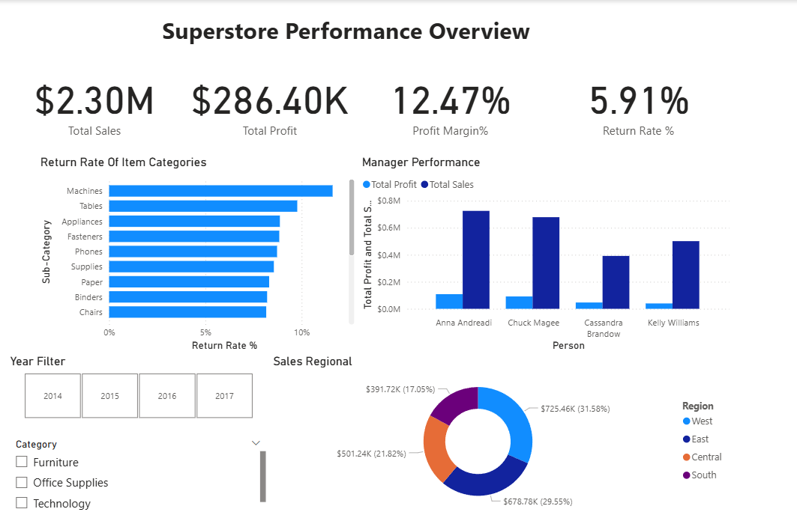

# Superstore Sales Dashboard (Power BI) 📊

## What's This Project?
This is an end-to-end Business Intelligence project using **Power BI**. I analyzed 4 years of retail sales data (2014-2017) to help executives track performance, understand trends, and identify problem areas like high return rates.

## The Tech Stack
* **Tool:** Microsoft Power BI Desktop
* **ETL:** Power Query (for cleaning & merging multiple sheets)
* **Modeling:** Star Schema (connecting Orders, Returns, and People)
* **Analysis:** DAX (Data Analysis Expressions) for custom calculations

## Key Features & "Under the Hood" Stuff
Here is what I actually built inside the file:

1.  **Solid Data Modeling:**
    * I didn't just use one table. I connected the **Fact Table** (`Orders`) with **Dimension Tables** (`Returns`, `People`) using a Star Schema approach.
    * Fixed a tricky "One-Way Filtering" issue to calculate Return Rates accurately across different tables.

2.  **Advanced DAX Measures:**
    * **Time Intelligence:** Created measures to calculate *Sales Last Year* (`SAMEPERIODLASTYEAR`) and *Year-over-Year Growth* to track progress.
    * **Dynamic Metrics:** Built a custom `Return Rate %` measure that responds to any slicer selection.
    * **Measure Table:** Kept things clean by organizing all calculations in a dedicated `_KeyMetrics` table.

## The Insights (What did the data say?)

1.  **Manager Performance:**
    * **Anna** is the MVP. She consistently leads in both Total Sales and Total Profit across the years, outperforming other regional managers.

2.  ** The "Returns" Problem:**
    * While the average return rate is manageable, specific high-value items (like **Copiers** and **Machines**) showed alarming return rates (spiking >7% in some cuts). This was identified using a specific cross-table analysis.

3.  **Growth Trends:**
    * The business is healthy with a positive Year-over-Year (YoY) growth trend, showing strong peaks in Q4 (holiday season) consistently.

## How to Run
1.  Download the **`Superstore 2014-2017 dashboard.pbix`** file from this repo.
2.  Open it in **Power BI Desktop**.
